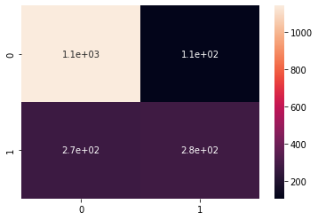

# Cancellation of a Financial Product
In this project, I explore financial data to predict whether customer will cancel a specific product before two years.  

## Problem
This project is a solution to the hackathon of Kin Analytics company. The problem is to predict which customers will drop a product in less than two years based on their use of the company's products and financial data like bank account transactions and credit bureau scores.  

## Solution
To do this, I perform 6 steps to develop my proposed solution:
1. Desired Population: Adequacy of the data , each filter to get only the desired customers to analyze.
2. New Variables: Get the age, number of products, account balance, and bureau score at the moment of application of each costumer.
3. Exploring Data: Way to select a prediction model.
4. Prediction model: Creation of different classifier models.
5. Evaluation: Comparison with a base model, cross-validation process, and some predictions for a confusion matrix.
6. Conclusion: Some thoughts about the process.  

## Prediction model
After cleaning the data, I run several classifiers with these accuracy results:
- K Neighbors: 0.75835
- Decision Tree: 0.77394
- Logistic Regression: 0.70545
- Support Vector, poly kernel: 0.76726
- Support Vector, rbf kernel: 0.77116
- Random Forest: 0.78341
- Gradient Boosting: 0.79065  

## Evaluation
To evaluate the selected models in the last section, I did: 1) Compare with a reference model 2) Run a cross-validation 3) Make a prediction and generate the confusion matrix. For example, the result of the confusion matrix was:
  

## Final notes
* For a detalied explaniaton, please read prediction.ipynb
* For a brief explanation, please read Hackathon Presentation.pdf